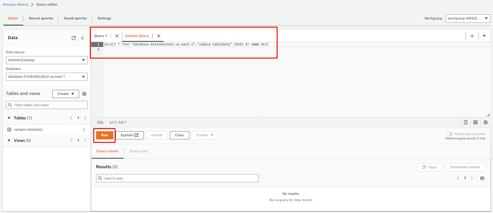
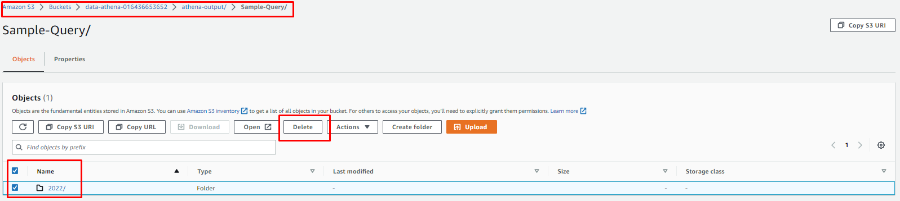

# AWS_Athena_with_Glue_CloudFormation_Deployment_on_existing_S3_Bucket_Data_Through_AWSConsole

## Description
Query existing S3 bucket data with AWS Athena, Glue through AWS console with the CloudFormation Deployment

## Overview
This document provides detail on a CloudFormation template of Athena with Glue crawler that can be deployed on your existing S3 bucket. The template defines some parameters for the existing S3 bucket, an IAM Role for Glue, Athena Workgroup, Glue Database, and a Glue Crawler which scans your S3 bucket and populates the Glue Database tables with the recordings metadata and a simple query that is saved and can be run with selecting workgroup defined in the template.

## Step - 1
Open visual studio code and create a YAML file with any specific name and paste the CloudFormation stack code into that file and save.

```yaml
# Sample CF YAML to demonstrate creating S3 buckets with Glue Database.
AWSTemplateFormatVersion: '2010-09-09'
 
# The Parameters section contains the name of the resource for your environments.
Parameters:
  DataS3BucketARN:
    Type: String
    Default: arn:aws:s3:::data-athena-016436653652
  DataS3BucketPath:
    Type: String
    Default: s3://data-athena-016436653652/data/
  OutputS3BucketPath:
    Type: String
    Default: s3://data-athena-016436653652/athena-output/
#  TablePrefixName:
#    Type: String
#    Default: table-arn:aws:s3:::data-athena-016436653652
 
# The Resources section defines metadata for the Resources.
# Create IAM Role assumed by the crawler. For demonstration, this role is given all related permissions.
Resources:
  AWSAthenaGlueRole:
    Type: AWS::IAM::Role
    Properties:
      AssumeRolePolicyDocument:
        Statement:
        - Effect: Allow
          Principal:
            Service:
            - glue.amazonaws.com
          Action:
            - sts:AssumeRole
      Path: "/"
      Policies:
      - PolicyName: AWSAthenaAccess
        PolicyDocument:
          Statement:
            - Effect: Allow
              Action: athena:*
              Resource: '*'
      - PolicyName: AWSGlueS3Access
        PolicyDocument:
          Statement:
            - Effect: Allow
              Action:
                - glue:*
                - iam:ListRolePolicies
                - iam:GetRole
                - iam:GetRolePolicy
              Resource: '*'
            - Effect: Allow
              Action:
                - s3:GetBucketLocation
                - s3:ListBucket
                - s3:ListAllMyBuckets
                - s3:GetBucketAcl
                - s3:GetObject
              Resource: !Sub
                - ${DataS3BucketARN}*
                - { DataS3BucketARN: !Ref DataS3BucketARN }
            - Effect: Allow
              Action:
                - s3:GetObject
              Resource:
                - 'arn:aws:s3:::crawler-public*'
                - 'arn:aws:s3:::aws-glue-*'
      - PolicyName: AWSCloudWatchAccess
        PolicyDocument:
          Statement:      
            - Effect: Allow
              Action:
                - logs:CreateLogGroup
                - logs:CreateLogStream
                - logs:GetLogEvents
                - logs:PutLogEvents
              Resource: 'arn:aws:logs:*:*:/aws-glue/*'
 
# Create a database to contain tables created by the crawler.
  AWSGlueDatabase:
    Type: AWS::Glue::Database
    Properties:
      DatabaseInput:
        Name: !Sub database-${AWS::AccountId}-${AWS::Region}
        Description: !Sub database-${AWS::AccountId}-${AWS::Region}
      CatalogId: !Ref AWS::AccountId
 
# Create athena workgroup for query.
  AWSAthenaWorkGroup:
    DependsOn:
      - AWSGlueCrawler
    Type: AWS::Athena::WorkGroup
    Properties:
      Name: !Sub workgroup-AWSGlueCrawler
      Description: 'AWS Athena WorkGroup'
      State: ENABLED
#      RecursiveDeleteOption: true
      WorkGroupConfiguration:
        EnforceWorkGroupConfiguration: false
        PublishCloudWatchMetricsEnabled: true
#        RequesterPaysEnabled: false
        ResultConfiguration:
          OutputLocation: !Ref OutputS3BucketPath
          EncryptionConfiguration:
            EncryptionOption: 'SSE_S3'
       
 
# Create a crawler to crawl the data on a Raw Data S3 bucket.
  AWSGlueCrawler:
    DependsOn:
      - AWSAthenaGlueRole
      - AWSGlueDatabase
    Type: AWS::Glue::Crawler
    Properties:
      Name: !Sub Crawler-${AWS::AccountId}-${AWS::Region}
      Role:
        Fn::GetAtt: [ AWSAthenaGlueRole, Arn ]
      Description: AWS Glue crawler to crawl data
      Schedule:
        # Run crawler every day every 6 hours Monday to Friday cron(0 0/6 ? * MON-FRI *)
        ScheduleExpression: 'cron(0 0/6 ? * MON-FRI *)'
      DatabaseName: !Ref AWSGlueDatabase
      Targets:
        S3Targets:
          - Path: !Ref DataS3BucketPath
            Exclusions:
              - "**.wav"
              - "**.webm"
              - "**.zip"
              - "**.opus"
              - "**.txt"
      TablePrefix: 'sample-table'
      SchemaChangePolicy:
        UpdateBehavior: "UPDATE_IN_DATABASE"
        DeleteBehavior: "LOG"
      Configuration: "{\"Version\":1.0,\"CrawlerOutput\":{\"Partitions\":{\"AddOrUpdateBehavior\":\"InheritFromTable\"},\"Tables\":{\"AddOrUpdateBehavior\":\"MergeNewColumns\"}}}"
 
# Create a sample query in Athena.
  SampleQueryDate:
    DependsOn:
      - AWSAthenaWorkGroup
      - AWSGlueCrawler
      - AWSGlueDatabase
    Type: AWS::Athena::NamedQuery
    Properties:
      Name: 'Sample-Query'
      Description: 'Query that lists ProductPrices file paths, starting from the most recent StartDate.'
      Database: !Ref AWSGlueDatabase
      QueryString: >
                    SELECT * FROM "database-016436653652-us-east-1"."sample-tabledata"
                    ORDER BY name DESC
      WorkGroup: !Ref AWSAthenaWorkGroup
 
# Show output results after completion of Cloud Formation Stack.
Outputs:
  AWSAthenaGlueRole:
    Value: !Ref AWSAthenaGlueRole
    Export:
      Name: !Sub "AWSAthenaGlueRole-Name"
  AWSGlueDatabase:
    Value: !Ref AWSGlueDatabase
    Export:
      Name: !Sub "AWSGlueDatabase-name"
  AWSGlueCrawler:
    Value: !Ref AWSGlueCrawler
    Export:
      Name: !Sub "AWSGlueCrawler-name"
  SampleQueryDate:
    Value: !Ref SampleQueryDate
    Export:
      Name: !Sub "SampleQueryDate-name"
```

Note: Make sure your indentations are correct.
By using parameters, we are defining the existing S3 bucket, it’s path and output path for the query output which we are using in defining glue crawler and workgroup.

## Step - 2
Login to your AWS account and go to the CloudFormation console and select the nearest working region in which you want to deploy your infrastructure stack.

You can also deploy your stack through AWS CLI command

`aws cloudformation create-stack --stack-name Athena-infrastructure --template-body file://./file-name.yml`

And from AWS console


Click on the "Create stack" button, select "Template is ready".
In the "Specify template" panel, select the "Upload a template file", and "Choose file" buttons to select your file, and click the "Next" button


Provide the “Stack name” and as you can see Parameters are already defined which we provided through YAML file, click the “Next” button


Rest of all leave as default and click “Next”


Review the things, acknowledge and click the “Submit” button.


After successfully deploying, you can check the resources created by the stack.


Also, you can check the output with export names.


## Step - 3
Now go to AWS Glue console, on left side panel click on “Crawlers”


Select the created crawler and click the “Run” button. The crawler will take some time to complete and create a metadata table.


When you click on the crawler that takes you to its detail page.

## Step - 3
On another side, you can check the crawler logs and table by going through the CloudWatch logs console and Glue console, Tables.


For Tables in AWS Glue


## Step - 4
Now finally go to AWS Athena console, select query editor, and from the left top drop-down menu select your workgroup where you can see your database and table details.


In the Saved query you can check if your query is there which you deployed through CloudFormation. Run the saved query to get your results.



After successful completion, your query results are saved in your S3 bucket output path.


## Step - 5
Finally, you can clean the whole stack by deleting the CloudFormation stack to avoid any extra charges but for CloudWatch and S3 buckets you have to manually delete the data.



